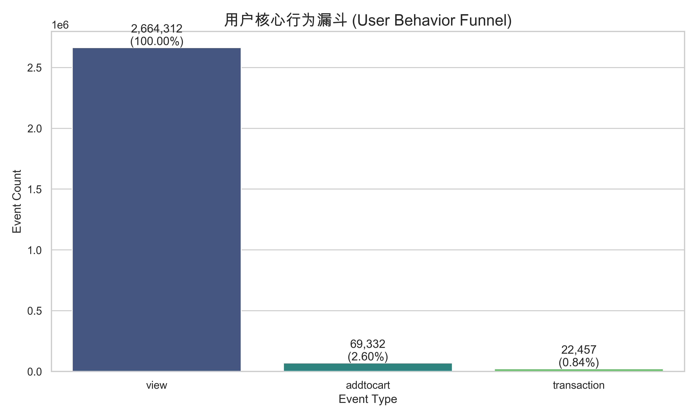
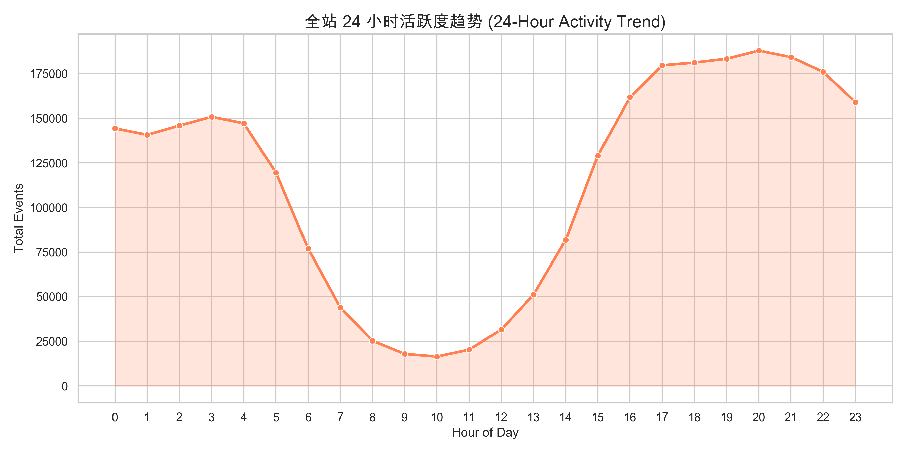
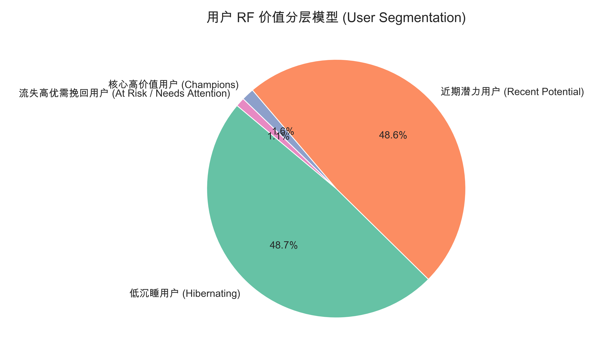

# Shopee AP: Data Analytics Case Study - Retailrocket E-commerce Platform

**Role Target**: Data Analytics (DA) / Product Management (PM) \
**Project Scope**: Event Log Analysis, Funnel Optimization, User Segmentation (RF Mode)

---

## 1. 核心业务漏斗洞察 (Core Funnel Insights)
*漏斗分析可以帮助我们迅速找到平台的“漏水”口，进而提出核心的产品界面和运营链路优化方案。*

### 数据结论
* **View (浏览)**: 2,664,312 (100%)
* **Add to Cart (加购)**: 69,332 (2.60% of views)
* **Transaction (购买)**: 22,457 (0.8429% overall)

### 诊断与策略建议：
- **诊断**：从浏览到加购的转化率处于极低的水平 (2.60%)，这在大型综合电商（如 Shopee）中意味着商品详情页（PDP页）并没有释放足够的购买促动意愿，或者浏览本身带有了大量无效流量（例如误触/低意向导流）。
- **策略：优化加购链路**
  - **产品侧优化**：对于高流量低加购率的单品，考虑在详情页透传更加直观的限时折扣标签 (`Flash Sale`) 和免邮券 (`Free Shipping`) 信息，以刺激首单加购。
  - **运营侧动作**：利用推荐系统给一直在观望的用户推出 “Bundle Deals (组合特惠)”，提升商品连带率和加购意愿。

---

## 2. 用户活跃大盘趋势 (User Activity Trend)
*用户的活跃高峰决定了我们的资源投放时段（例如大促营销推送时段配置）。*

### 数据结论
* 用户的行为波动存在着极强的波浪形周期，通过 24 小时的切片我们可以提取出流量的高峰期通常落在晚间时段的 **19:00 - 22:00** 附近。

### 诊断与策略建议：
- **资源精准投放**：Push notification 消息的推送、全网直播带货的流量引流应当密集排布在黄金时间段。
- **系统弹性扩容响应**：工程链路需留意晚间峰值的 TPS，确保结账链路 (`Checkout`) 不会出现限流。

---

## 3. 核心用户价值分阶：RF模型 (RF Segmentation)
*基于 Recency (最近消费时间) 与 Frequency (消费频次) 对发生过购买行为的用户进行打标签分群。*

### 数据结论
* 数据中复购的高价值活跃用户 (`核心高价值用户`) 占比较小，说明该平台存在极其依赖新客单次成交的窘境。
* 存在大量在过去有过多次购买，但近期陷入停滞状态的群体 (`流失高优需挽回用户`) 或是只购买过一次便无音讯的群体。

### 诊断与策略建议：
1. **针对核心高价值用户 (Champions)**：
   - 给予 VIP 及返现积分体系（如 Shopee Coins）的多倍奖励。优先体验新品的权益。
2. **针对流失高优需挽回用户**：
   - 这是曾经信任过平台的群体，流失可能因为竞对补贴。应通过唤醒邮件 (EDM) 或派发高门槛的大额满减券（如 Shopee 9.9 Super Shopping Day Voucher）来精准刺激复购。
3. **针对近期的新晋买家 (最近购物，但频次仅有1次)**：
   - 提供新客专享的复购关怀盲盒或低客单价的高复购引流品（如快消品、纸巾等）促使其完成第二次下单，从而养成心智。
